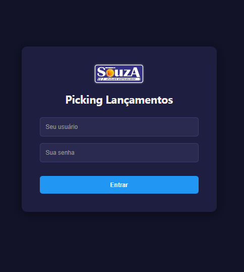

# 📦 Sistema de Gerenciamento de Expedição - Comercial Souza

---

## 📝 Descrição do Projeto

O setor de expedição enfrentava gargalos críticos no monitoramento da produção. A dependência de planilhas Excel massivas para alimentar o Power BI gerava latência de dados (atualizações de hora em hora) e alta incidência de erros humanos (duplicatas e digitação).

### **A Solução**
Desenvolvi uma arquitetura híbrida que centraliza a gestão:
* **Backend de Automação:** Robôs em **Python** que realizam a integração real-time com o ERP e limpeza de dados.
* **Interface Web:** Front-end e API em **PHP** para operação direta no chão de fábrica, garantindo agilidade e controle de status.

### **Resultados Obtidos**
* ✅ **Fim da latência:** Dados disponíveis em tempo real.
* ✅ **Integridade:** Bloqueio nativo de duplicidades e faxina automática de registros inconsistentes.
* ✅ **Performance:** Redução drástica do overhead de processamento em comparação ao Excel.

---

## 🛠️ Funcionalidades Principais

* **Monitoramento Real-Time:** Sincronização contínua com o banco de dados do ERP.
* **Fluxo de Operação (Picking):** Controle total por status (*em separação, expedido, conferido, finalizado*).
* **Robô Faxina:** Script Python dedicado à normalização de dados e correção de erros de digitação.
* **Gestão de Ocorrências:** Registro e auditoria de eventos operacionais para rastreabilidade.
* **Operação Multiusuário:** Controle de acessos e permissões para diferentes perfis (Recepção, Conferência, Gestão).

---

## 🏗️ Arquitetura do Sistema

O projeto é dividido em duas camadas principais:

### 1. Camada de Operação (Web Interface)
Localizada no diretório `/picking`, responsável pela interação com o usuário.
* **Controle de Acesso:** `login.php`, `logout.php`, `troca_senha.php`.
* **Operacional:** `funcionarios.php`, `registro_ocorrencias.php`, `pickingtv.html`.
* **Integração de Dados:** APIs em PHP para comunicação interna.

### 2. Camada de Inteligência (Python Engine)
Localizada em `/picking_realtime`, atua como o "motor" do sistema.
* **`main.py`**: O robô principal que faz a ponte (ponte/bridge) entre o ERP e o MariaDB.
* **`robo_faxina.py`**: Automação cíclica para higienização da base de dados.
* **`transacao.py`**: Garante a atomicidade das operações, prevenindo falhas de gravação.

---

## 📸 Demonstração (Screenshots)

<table align="center">
  <tr>
    <td><b>Login & Segurança</b> </td>
    <td><b>Painel de Agendamentos</b> </td>
    <td><b>Visão Operacional</b> </td>
  </tr>
  <tr>
    <td><b>Controle de Cargas</b> </td>
    <td><b>Painel da Recepção</b> </td>
    <td><b>Módulo Público</b> </td>
  </tr>
</table>

---

## 👨‍💻 Equipe

* **Matheus Cabral** - *Desenvolvedor Principal* (Arquitetura, Python, PHP & DB)

---

## 📄 Licença
Projeto de uso restrito interno - **Souza Atacado Distribuidor**.
